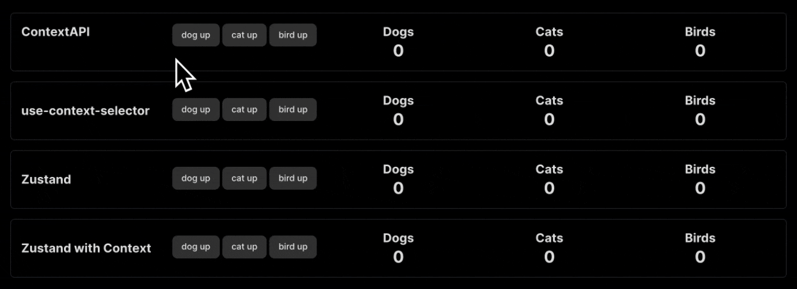
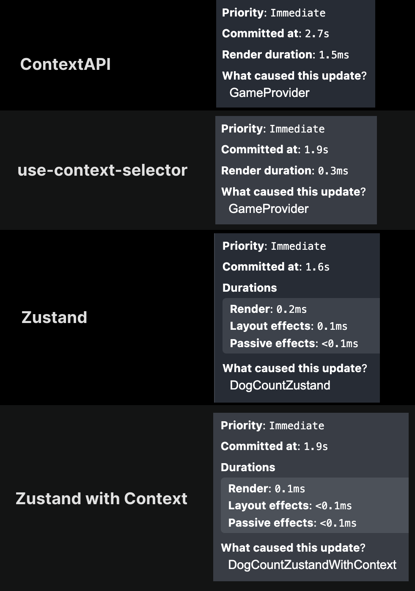

# React State Managers

This project explores different state managers for React and compares their performance. The state managers included in this project are:

- React Context API
- use-context-selector
- Zustand
- Zustand with Context

The goal is to use React Dev Tools to inspect how renders occur with each state manager and evaluate their performance.

Here is the project running, highlighting the components that re-render:



Render duration:



### Installation

```bash
yarn
```

### Run

```bash
yarn dev
```
